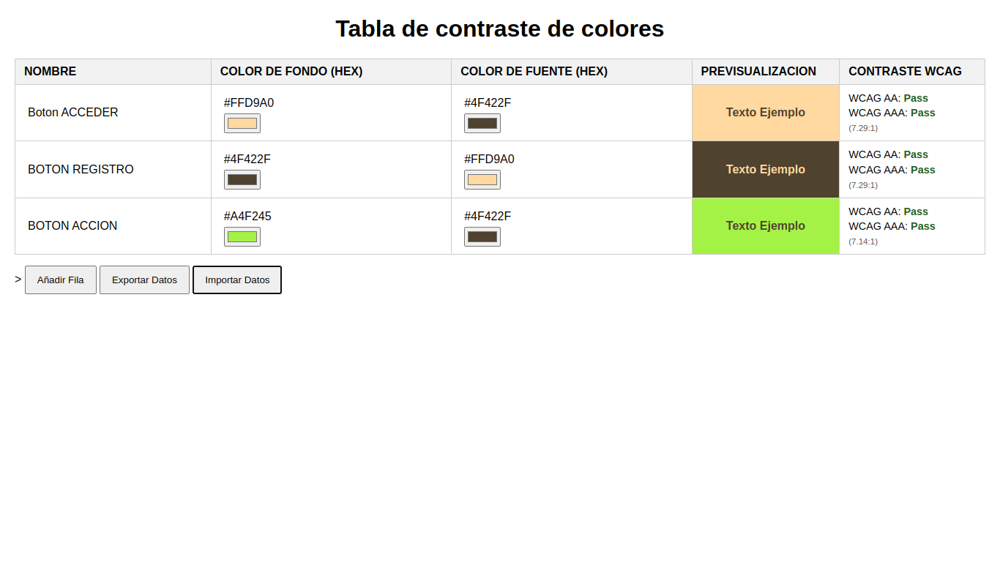

# WCAG Color Contrast Checker (Probador de Contraste de Color WCAG)



Herramienta web sencilla para gestionar y evaluar pares de colores (fondo y fuente) según las Pautas de Accesibilidad para el Contenido Web (WCAG) 2.1 sobre el ratio de contraste. Permite añadir, editar, previsualizar y verificar la accesibilidad de combinaciones de colores directamente en el navegador.

**Esta aplicación es completamente estática (HTML, CSS, JavaScript) y utiliza el `localStorage` del navegador para persistencia de datos, ¡no requiere backend!**

## ✨ Características

* **Añadir/Editar Pares de Color:** Define nombres para tus combinaciones y edita los colores de fondo y fuente usando códigos HEX.
* **Previsualización Instantánea:** Muestra cómo se ve el texto con el color de fuente sobre el color de fondo seleccionado.
* **Cálculo de Contraste WCAG:** Calcula automáticamente el ratio de contraste entre el fondo y la fuente.
* **Indicadores de Accesibilidad:** Muestra claramente si la combinación cumple con los niveles **AA** y **AAA** de WCAG 2.1 (Ratio >= 4.5 para AA, Ratio >= 7.0 para AAA).
* **Persistencia Local:** Guarda tus datos automáticamente en el `localStorage` de tu navegador. ¡No perderás tu trabajo al refrescar o cerrar la página!
* **Exportar Datos:** Guarda todas tus combinaciones de colores en un archivo `.json` para respaldo o para compartir.
* **Importar Datos:** Carga combinaciones de colores desde un archivo `.json` previamente exportado.

## 🚀 Cómo Usar

### Opción 1: Online

Puedes probar la aplicación en vivo aquí: https://primitivo23893.github.io/WCAG-Test/


### Opción 2: Ejecutar Localmente

1.  Clona este repositorio:
    ```bash
    git clone https://github.com/primitivo23893/WCAG-Test.git
    ```
2.  Navega a la carpeta del proyecto:
    ```bash
    cd WCAG-Test
    ```
3.  Abre el archivo `public/index.html` directamente en tu navegador web preferido (Firefox, Chrome, Edge, etc.).


## 🛠️ Tecnologías Utilizadas

* HTML5
* CSS3
* JavaScript (Vanilla JS - Sin frameworks)
* API `localStorage` del Navegador

## 💾 Persistencia de Datos

Los datos que añades o modificas se guardan automáticamente en el `localStorage` de tu navegador. Esto significa que:
* Los datos persisten entre sesiones (si cierras y vuelves a abrir el navegador).
* Los datos son **específicos para el navegador y el dominio** donde se usa la aplicación. No se sincronizan entre diferentes navegadores o dispositivos.
* Si limpias los datos de navegación de tu navegador para este sitio, los datos guardados se perderán.

## 📥 Importar / Exportar 📤

* **Exportar:** Haz clic en el botón "Exportar Datos". Se generará y descargará un archivo `color_data.json` con todas las filas de tu tabla actual.
* **Importar:** Haz clic en "Importar Datos", selecciona un archivo `.json` (que tenga el formato esperado: un array de objetos con `id`, `nombre`, `colorFondo`, `colorFuente`). Los datos importados reemplazarán la tabla actual y se guardarán en `localStorage`.


---

_Creado por [primitivo23893](https://github.com/primitivo23893) - 2025_
